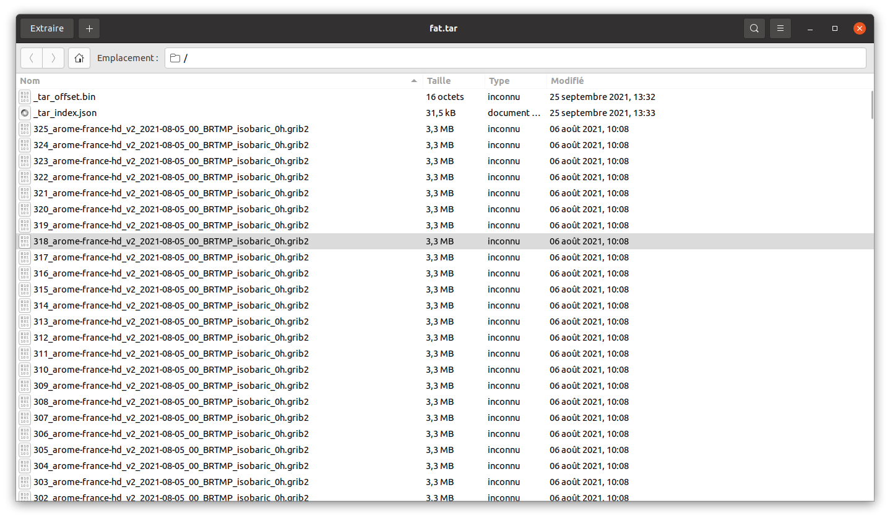

# pyindexedtar

An indexed Tar for big data archives featuring fast random access with an index bundled inside the tarfile.

The use case is to retrieve members of a "many members" tar archive without seeking
from one member to the next.

# Goals

We constrained this code as follows:

* Produce archives fully compliant with the tar specification to
preserve compatibility with existing tools

* No additional index file, the archive should contain the index and be 'all inclusive'

* Use only the python standard library

# Installation

For now I haven't released on pypi.

```
python setup.py install
```

Note: when using pyenv I needed to reactivate my virtualenv post-install to have the **itar** cli available.

# Usage of the `itar` cli

```bash
itar --help
usage: itar [-h] [--target TARGET] [--fnmatch_filter FNMATCH_FILTER] [--output_dir OUTPUT_DIR] action archive

IndexedTar build/extract utility.

positional arguments:
  action                action to perform: "x" for extract, "l" for listing, "c" for create, "a" for append
  archive               path to archive file

optional arguments:
  -h, --help            show this help message and exit
  --target TARGET       file or directory to add
  --fnmatch_filter FNMATCH_FILTER
                        fnmatch filter for listing/extracting archive members
  --output_dir OUTPUT_DIR
                        output directory for extraction
```

Create an archive  with the files in the **tests/data** directory.

```bash
itar c test.tar --target tests/data
```

List archive members matching a fnmatch pattern.

```bash
itar l test.tar --fnmatch_filter "*3h.grib2"
```

Extract members matching a fnmatch pattern to output directory.

```bash
itar x test.tar --fnmatch_filter "*arome*.grib2" --output_dir out
```

# Usage of the `IndexedTar` class

See the [unit tests](https://github.com/colon3ltocard/pyindexedtar/blob/master/tests/test_indexedtar.py) for usage examples.

## Create an archive.

```python
DATA_DIR = pathlib.Path("/home/frank/dev/mf-models-on-s3-scraping")

from indexedtar import IndexedTar

it = IndexedTar("test.tar", mode="x:")
it.add_dir(DATA_DIR)
it.close()
```
## Get a tarmember by index

```python
DATA_DIR = pathlib.Path("/home/frank/dev/mf-models-on-s3-scraping")

from indexedtar import IndexedTar
it = IndexedTar(pathlib.Path("fat.tar"), mode="r:")
tinfo = it.getmember_at_index(5) # get 5th member from the archive
print(tinfo.name)
```

## Extracting some members
```python
with tempfile.TemporaryDirectory() as td:
    with IndexedTar(Path("my_indexed_archive.tar)) as it:
        members = []
        for i in range(4):
            members.append(next(it.get_members_by_name(f"{i}_arome.grib2")))
        it.extract_members(members, path=td)
```

## Get  members matching a name

```python

from indexedtar import IndexedTar
it = IndexedTar(pathlib.Path("fat.tar"), mode="r:")
print([x for x in it.get_members_by_name("8125_arome-france-hd_v2_2021-08-05_00_BRTMP_isobaric_0h.grib2")])
```

## Get members matching a regex or a fnmatch pattern

```python
    no_files = 6
    with tempfile.TemporaryDirectory() as td:
        tdp = Path(td)
        with IndexedTar(tdp / "indexed.tar", "x:") as it:
            # let's simulate an archive spawning over
            # several days of data with a jump
            for the_date in ("2021_01_25", "2021_01_26", "2021_02_01"):
                for i in range(no_files):
                    it.add(arome_grib2, arcname=f"{the_date}/{i}_arome_t.grib2")
        
        with IndexedTar(tdp / "indexed.tar", "r:") as it:
            # Now we read members using our filter methods
            assert len(list(it.get_members_fnmatching("2021_01_26/*"))) == no_files
            assert len(list(it.get_members_fnmatching("2021_01_26/*", do_reversed=True))) == no_files
            assert len(list(it.get_members_fnmatching("*"))) == no_files*3

            assert len(list(it.get_members_re("^2021"))) == no_files*3
            assert len(list(it.get_members_re("^2021_02_01"))) == no_files
            assert len(list(it.get_members_re("^2021_02_01", True))) == no_files

            assert len(list(it.get_members_by_name("2021_02_01/0_arome_t.grib2", True))) == 1
            assert len(list(it.get_members_by_name("2021_02_01/0_arome_t.grib2"))) == 1

            assert it.getmember_at_index(0).name == "2021_01_25/0_arome_t.grib2"
```

# Concept

The trick here is to have a 'normal' binary file
added at the beginning of the tar that serves as a
pre-allocation of 3 unsigned long long to
store header and data offsets + the size of our index.

When we close the archive we write the index
as the last file in the tar and seek back to the
location of the offset and size to write it.

```
######
_tar_offset.bin tar header
-----
_tar_offset.bin payload
unsigned long long value1 => points to >>>>>------------------|
unsigned long long value2 => points to index data
unsigned long long  value3 => index len                       |
######                                                        |
FILE 1 - tar header                                           |
-----                                                         |
FILE 1 - data          <<<<<<oooooooooooooooooooooooo         |
                                                    o         |
....                                                o         |
                                                    o         |
######                                              o         |
FILE N tar header                                   o         |
-----                                               o         |
FILE N data                                         o         |
######                                              o         |
_tar_index.json - tar header <<<<<<<<<--------------o---------|
------                                              o
_tar_index.json data                                o
[[FILE_1_NAME, FILE_1_TINFO_OFFSET, FILE_1_DATA_OFFSET>, FILE_1_SIZE],
...
[FILE_N_NAME, FILE_N_TINFO_OFFSET, FILE_N_DATA_OFFSET, FILE_N_SIZE]]
######
```

This gives us the following workflow to retrieve a member 'A':
```
open Indexedtar >>> read first member ( = index offset) >>> seek at index offset >>> read index >>> lookup 'A''s offset in index >>> read 'A'.
```

# Benchmark on a desktop HDD for a 2.1 GB tarfile with 6094 members

We extract the last member of the archive. See `benchmark.py`.

```
(indexenv) [frank@localhost pyindexedtar]$ python benchmark.py 

python IndexedTar average extraction time: 0.0156 seconds
python Tar average extraction time: 1.5477 seconds
GNU Tar average extraction time: 0.0476 seconds

```

# Compatiblity checks

Our archive stills open with the standard cli tool or GUi tool on Ubuntu.



```
(indextarenv)$ tar -tvf fat.tar 
-rw-r--r-- 0/0              16 2021-09-25 13:32 _tar_offset.bin
-rw-rw-r-- frank/frank 3303788 2021-08-06 10:08 0_arome-france-hd_v2_2021-08-05_00_BRTMP_isobaric_0h.grib2
-rw-rw-r-- frank/frank 3303788 2021-08-06 10:08 1_arome-france-hd_v2_2021-08-05_00_BRTMP_isobaric_0h.grib2
-rw-rw-r-- frank/frank 3303788 2021-08-06 10:08 2_arome-france-hd_v2_2021-08-05_00_BRTMP_isobaric_0h.grib2
-rw-rw-r-- frank/frank 3303788 2021-08-06 10:08 3_arome-france-hd_v2_2021-08-05_00_BRTMP_isobaric_0h.grib2
-rw-rw-r-- frank/frank 3303788 2021-08-06 10:08 4_arome-france-hd_v2_2021-08-05_00_BRTMP_isobaric_0h.grib2
-rw-rw-r-- frank/frank 3303788 2021-08-06 10:08 5_arome-france-hd_v2_2021-08-05_00_BRTMP_isobaric_0h.grib2
-rw-rw-r-- frank/frank 3303788 2021-08-06 10:08 6_arome-france-hd_v2_2021-08-05_00_BRTMP_isobaric_0h.grib2
-rw-rw-r-- frank/frank 3303788 2021-08-06 10:08 7_arome-france-hd_v2_2021-08-05_00_BRTMP_isobaric_0h.grib2
-rw-rw-r-- frank/frank 3303788 2021-08-06 10:08 8_arome-france-hd_v2_2021-08-05_00_BRTMP_isobaric_0h.grib2
-rw-rw-r-- frank/frank 3303788 2021-08-06 10:08 9_arome-france-hd_v2_2021-08-05_00_BRTMP_isobaric_0h.grib2
-rw-rw-r-- frank/frank 3303788 2021-08-06 10:08 10_arome-france-hd_v2_2021-08-05_00_BRTMP_isobaric_0h.grib2
...
```

# Todo and ideas

* add highwayhash (SIMD, should perform ! ) checksums for each file in the index
* See if we could handle 'tar.gz' compressed archive using ["IndexedGzip"]("https://github.com/pauldmccarthy/indexed_gzip") ?