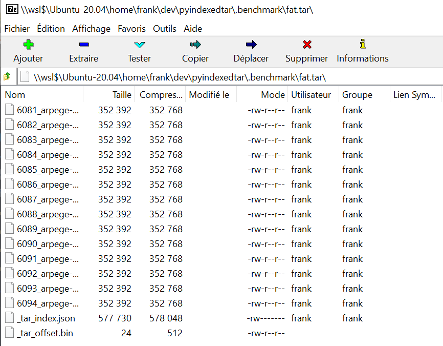

# pyindexedtar

A "proof of concept" of a python class to work with indexed Tar for big data archives.
The use case is to retrieve members of a "many members" tar archive without seeking
from one member to the next.

The idea is to add a first file at the beginning of the tar file which serves as
a pre-allocation to store the offset of an index for all files in the archive.

The goal is to be able to reach any file in the tar by seeking only once to the index and
then directly to the file offset in the tar found using said index.

The file produced is still a fully compliant tar archive.

See **indexedtar/__init__.py** inlined documentation.

The **IndexedTar** class depends only on the python standard library.

# Requirements

We constrained this poc as follows:

* Produce archives fully compliant with the tar specification to
preserve compat with existing tools

* Use only the python standard library

# Concept

```
######
_tar_offset.bin tar header
-----
_tar_offset.bin payload
unsigned long long value1 => points to >>>>>------------------|
unsigned long long  value2 => index len                       | 
######                                                        |
FILE 1 - tar header                                           |
-----                                                         |
FILE 1 - data          <<<<<<oooooooooooooooooooooooo         |
                                                    o         |
....                                                o         |
                                                    o         |
######                                              o         |
FILE N tar header                                   o         |
-----                                               o         |
FILE N data                                         o         |
######                                              o         |
_tar_index.json - tar header <<<<<<<<<--------------o---------|
------                                              o
_tar_index.json data                                o
[[FILE_1_NAME, FILE_1_TINFO_OFFSET, FILE_1_DATA_OFFSET>, FILE_1_SIZE],
...
[FILE_N_NAME, FILE_N_TINFO_OFFSET, FILE_N_DATA_OFFSET, FILE_N_SIZE]]
######
```

This gives us the following workflow to retrieve a member 'A':
```
open Indexedtar >>> read first member ( = index offset) >>> seek at index offset >>> read index >>> lookup 'A''s offset in index >>> read 'A'.
```

# Usage

## Create an archive.

```python
DATA_DIR = pathlib.Path("/home/frank/dev/mf-models-on-s3-scraping")

from indexedtar import IndexedTar

it = IndexedTar("test.tar", mode="x:")
it.add_dir(DATA_DIR)
it.close()
```
## Get a tarmember by index

```python
DATA_DIR = pathlib.Path("/home/frank/dev/mf-models-on-s3-scraping")

from indexedtar import IndexedTar
it = IndexedTar(pathlib.Path("fat.tar"), mode="r:")
tinfo = it.getmember_at_index(5) # get 5th member from the archive
print(tinfo.name)
```

## Get  members matching a name

```python

from indexedtar import IndexedTar
it = IndexedTar(pathlib.Path("fat.tar"), mode="r:")
print([x for x in it.get_members_by_name("8125_arome-france-hd_v2_2021-08-05_00_BRTMP_isobaric_0h.grib2")])
```

# Benchmark on a NVMe SSD and a 26.9 GB archive


We built a "big tar" archive of 26.9 GB with 8000+ entries made of grib2 data files using the follwing cmd:

```
export PYTHONPATH="."; python indexedtar/utils.py
ls -lh fat.tar
-rw-rw-r-- 1 frank frank 26G sept. 25 18:24 fat.tar
```

Next we trace lseek syscalls.


```
strace -e trace=lseek python benchmark.py fat.tar --mode other 2>&1 | grep lseek |wc -l
```
**>>> 40801 <<<**

```
strace -e trace=lseek python benchmark.py fat.tar --mode indexed 2>&1 | grep lseek |wc -l

```
**>>> 174 <<<**

First conclusion: to get and extract the last member, using the builtin TarFile there are 40801 lseek syscalls versus 174 for our IndexedTar.

```
time python benchmark.py fat.tar --mode other
<TarInfo '8125_arome-france-hd_v2_2021-08-05_00_BRTMP_isobaric_0h.grib2' at 0x7f8844a334c0>

real	0m0,639s
user	0m0,478s
sys	0m0,039s

time python benchmark.py fat.tar --mode indexed
Opening fat.tar, pax-headers: {}
Seeking header offset at 1536
Seeking index json at 26860269056 of len 821008
[<TarInfo '8125_arome-france-hd_v2_2021-08-05_00_BRTMP_isobaric_0h.grib2' at 0x7fefdf038400>]

real	0m0,073s
user	0m0,064s
sys	0m0,011s


```

Second conclusion: to get a member at the end of the archive, even on a SSD, we are 7x times faster.

# Compatiblity checks

Our archive stills open with the standard cli tool or GUi tool on Ubuntu.



```
(indextarenv) frank@desktop-tocard:~/dev/pyindexedtar$ tar -tvf fat.tar 
-rw-r--r-- 0/0              16 2021-09-25 13:32 _tar_offset.bin
-rw-rw-r-- frank/frank 3303788 2021-08-06 10:08 0_arome-france-hd_v2_2021-08-05_00_BRTMP_isobaric_0h.grib2
-rw-rw-r-- frank/frank 3303788 2021-08-06 10:08 1_arome-france-hd_v2_2021-08-05_00_BRTMP_isobaric_0h.grib2
-rw-rw-r-- frank/frank 3303788 2021-08-06 10:08 2_arome-france-hd_v2_2021-08-05_00_BRTMP_isobaric_0h.grib2
-rw-rw-r-- frank/frank 3303788 2021-08-06 10:08 3_arome-france-hd_v2_2021-08-05_00_BRTMP_isobaric_0h.grib2
-rw-rw-r-- frank/frank 3303788 2021-08-06 10:08 4_arome-france-hd_v2_2021-08-05_00_BRTMP_isobaric_0h.grib2
-rw-rw-r-- frank/frank 3303788 2021-08-06 10:08 5_arome-france-hd_v2_2021-08-05_00_BRTMP_isobaric_0h.grib2
-rw-rw-r-- frank/frank 3303788 2021-08-06 10:08 6_arome-france-hd_v2_2021-08-05_00_BRTMP_isobaric_0h.grib2
-rw-rw-r-- frank/frank 3303788 2021-08-06 10:08 7_arome-france-hd_v2_2021-08-05_00_BRTMP_isobaric_0h.grib2
-rw-rw-r-- frank/frank 3303788 2021-08-06 10:08 8_arome-france-hd_v2_2021-08-05_00_BRTMP_isobaric_0h.grib2
-rw-rw-r-- frank/frank 3303788 2021-08-06 10:08 9_arome-france-hd_v2_2021-08-05_00_BRTMP_isobaric_0h.grib2
-rw-rw-r-- frank/frank 3303788 2021-08-06 10:08 10_arome-france-hd_v2_2021-08-05_00_BRTMP_isobaric_0h.grib2
...
```
